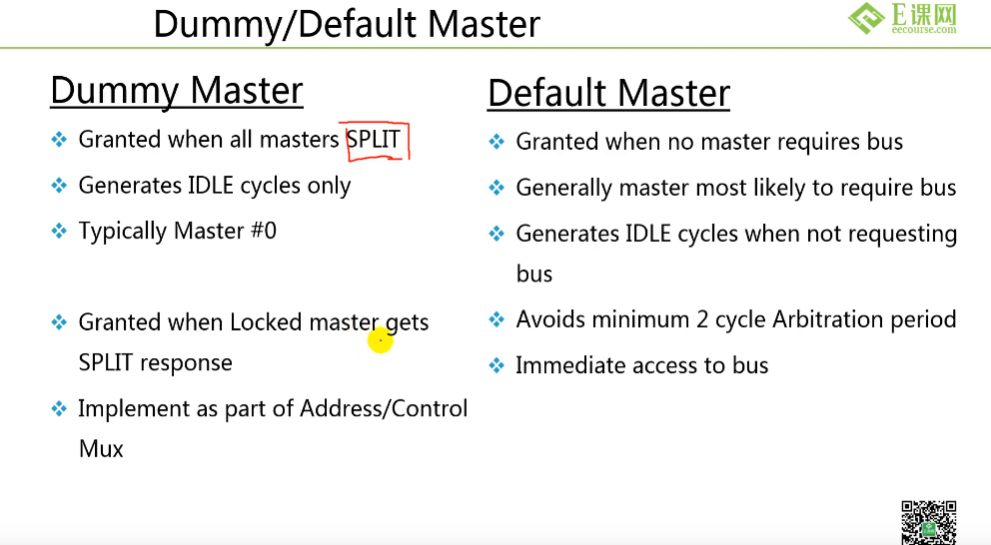
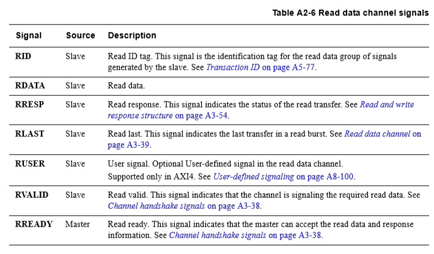

# IC笔记


## 码制

BCD余3码：BCD码+0011

### 格雷码


+ 格雷码-二进制转换如下所示：

  - 二进制转格雷码：保留最高位，剩余相邻位数异或。例如数据1001，结果为1101，如下：

  | 确定方式 | 运算    | 结果 |
  | -------- | ------- | ---- |
  | 取最高位 | 1       | 1    |
  | 异或     | 1 xor 0 | 1    |
  | 异或     | 0 xor 0 | 0    |
  | 异或     | 0 xor 1 | 1    |

  - 格雷码转二进制：保留最高位，从最高位往低运算，对于第n位为第n位格雷码和第n+1位的异或，例如数据1001，结果为1110，如下：

  | 确定方式 | 运算    | 结果 |
  | -------- | ------- | ---- |
  | 取最高位 | 1       | 1    |
  | 异或     | 0 xor 1 | 1    |
  | 异或     | 0 xor 1 | 1    |
  | 异或     | 1 xor 1 | 0    |

对应余三码

***

## 基本数电知识

### 常用逻辑门符号


### CMOS逻辑电路


+ N型MOS管：栅极输入高电平时导通；
+ P型MOS管：栅极输入低电平时导通；

**非门**


**与非门**


**或非门**


**三态门/传输门**


### CMOS工艺

+ 反相器中，NMOS参数不变的前提下，随着PMOS晶体管的宽长比的增加，$T_{PHL}$增加，$T_{PLH}$减小
+ 在schematic原理图中搭建电路时，所有pmos的衬底需要接VDD，所有nmos的衬底需要接VSS。
+ 速度大小按快到慢依次排列为SLVT, LVT, RVT, HVT。 功耗大小却正好相反。即HVT的cell其阈值电压最大其掺杂浓度越高，其泄露功耗最小；
+ 对于NPN的晶体管是n型半导体，其导电是电子，P衬底多子是空穴，掺杂越高电子越少，越难以导电，阈值电压上升，泄露功耗变少。
+ 对于PNP晶体管是P型半导体，其导电是空穴，N型衬底是电子，掺杂越高空穴越少，越难以导电。

### 触发器与锁存器

+ 锁存器：电平敏感
+ 触发器：边沿敏感
+ 都属于时序电路；组合逻辑电路的输出只和当前输入有关，而时序电路的输出不仅与当前输入有关还和之前的输出有关

**SR锁存器**

基本SR锁存器由两个或非门组成


其功能表如下：

| S    | R    | 功能                   |
| ---- | ---- | ---------------------- |
| 0    | 0    | 保持                   |
| 0    | 1    | 置0                    |
| 1    | 0    | 置1                    |
| 1    | 1    | 非定义状态，最好不出现 |

SR锁存器需要约束：$SR=0$

**常见触发器表达式**

D触发器

$Q = D$

JK触发器

$Q^{n+1} = J{Q^{n}}'+K'Q^{n}$

T触发器

$Q^{n+1}=TQ^{n}{'}+T{'}Q^{n}$

SR触发器

$Q^{n+1}=S+R{'}Q^n$

***

### 环形振荡器


**TPLH**为低电平到高电平所需时间，**TPHL**为高电平到低电平所需时间。

以图中振荡器为例分析：

+ 初始电平为高电平，经过5个非门取反后，变为低电平，再经过5个非门取反后变为高电平
+ 从高电平到低电平消耗时间为：$TPHL*3+TPLH*2$
+ 低电平到高电平消耗时间为：$TPLH*3+TPHL*2$
+ 单个周期时间为$N*(TPHL+TPLH)$，N为非门个数

***

### FPGA基本单元

LUT（查找表）

本质是一个RAM，事先确定存储值。

然后根据输入，输出对应地址结果

***

### 竞争与冒险

+ 组合逻辑电路
+ 由于信号电平翻转时会有一段时间处于亚稳态


+ 竞争：在组合电路中，信号经由不同的途径达到某一会合点的时间有先有后，这种现象称为竞争。

  冒险：由于竞争而引起电路输出发生瞬间错误现象称为冒险。表现为输出端出现了原设计中没有的窄脉冲，常称其为毛刺。

  竞争与冒险的关系：有竞争不一定会产生冒险，但有冒险就一定有竞争。

  在组合逻辑中，由于门的输入信号通路中经过了不同的延时，导致到达该门的时间不一致叫竞争。
  产生毛刺叫冒险。如果布尔式中有相反的信号则可能产生竞争和冒险现象。

判定依据：

- 如果输出端门电路的两个输入信号A和A’是输入变量A经过两个不同的传输途径而来，则当输入变量A的状态发生突变时输出端有可能产生尖峰脉冲，故**只要输出端的逻辑函数在一定条件下能简化成Y＝A＋ A’或 Y＝A · A’,则可判定存在竞争－冒险现象**

两种情况：

+ $Y=A+A'$，产生一个低电平
+ $Y = A\cdot A'$，产生一个尖峰脉冲，高电平脉冲

消除方法：

+ 接入滤波电容：在门电路的输出端并接一个很小的滤波电容，简单，但是会使输出波形变差

+ 引入选通脉冲：门电路的输入或者输出加一个选通控制器，使电路在输入稳定后再输出结果即可。

+ 修改逻辑设计：增加**冗余项**

  例子：

  $Y=AB+A'C$,当$B = C = 1$时：$Y = A + A ′$ 
  说明此电路存在竞争冒险现象。
  增加冗余项，$Y = A B + A ′ C + B C$ 

***

### 芯片功耗

$$
总功耗=开关功耗+短路功耗+静态功耗
$$

动态功耗包括开关功耗和短路功耗
$$
开关功耗=C\bullet V^2 \bullet F
$$
其中$C$为负载电容，$V$是电压，$F$是频率
$$
短路功耗 = V \bullet I(短路)
$$
其中$I(短路)$为在开关切换过程中N极和P极同时有效时发生的短路电流。
$$
静态功耗= V \cdot I(漏电)
$$
静态功耗（漏电功耗）是晶体管在电路稳定时出现的漏电造成的功耗

***

## IC流程


***

## 数字后端实现

### LVT,RVT,HVT等

+ COMS集成电路的$V_{th}$阈值电压概念

HVT = High V threshold. Can be used in the path where timing is not critical. So by using HVT cells we can save power.

SVT- Standard V threshold. Best of both world. Medium delay and medium power requirment. So if timing is not met by small magin with HVT, you should try with SVT. And at last LVT.

RVT- Regular V threshold.  Another name for SVT.

LVT - Low V threshold. One should use these cells in timing critical paths. These cells are fast but , comsumes more power due to its leakage. So it will consume more power. So use only when timing is critical.

SLVT - Super low V threshold

ULVT - 

阈值电压越低，因为饱和电流变小，所以速度性能越高；但是因为漏电流会变大，因此功耗会变差。

速度大小按快到慢依次排列为SLVT, LVT, RVT, HVT。 功耗大小却正好相反。即HVT的cell其阈值电压最大其掺杂浓度越高，其泄露功耗最小；

对于NPN的晶体管是n型半导体，其导电是电子，P衬底多子是空穴，掺杂越高电子越少，越难以导电，阈值电压上升，泄露功耗变少。

对于PNP晶体管是P型半导体，其导电是空穴，N型衬底是电子，掺杂越高空穴越少，越难以导电。

***

## 存储器

### 存储器分类


***

## verilog 避免锁存器

### Latch与flip-flop

Latch为电平触发的存储单元，数据存储的动作取决于输入时钟（或者使能）信号的电平值。仅当锁存器处于使能状态时，输出才会随着数据输入变化。

flip-flop为边沿敏感的存储单元

+ 一般情况下，在Verilog电路综合时，我们不希望寄存器会被综合成latch

Latch的主要危害有：

+ 输入状态可能有多次变化，容易产生毛刺，增加了下一级电路的不确定性；
+ 在大部分FPGA的资源中，可能需要比触发器更多的资源去实现锁存器；
+ 锁存器的出现使得静态时序分析变得更加复杂

Latch多用于门控时钟（clock gating）的控制，一般设计时应当避免Latch的产生。

### 产生Latch的语句

+ **组合逻辑**中，不完整的if-else结构（默认寄存器值不变，导致锁存器出现）
+ **组合逻辑**中，不完整的case结构，即没有给所有选项赋值或者没有加**default**
+ **组合逻辑**中，原信号赋值或判断，即被驱动信号受到其本身控制
+ **组合逻辑**中，敏感信号列表不完整

### 避免锁存器出现的要点

+ if-else或case语句，结构一定要完整
+ 不要将赋值信号放在赋值源头，或条件判断中
+ 敏感信号列表建议多使用`always @(*)`

***

## 电路静态时序分析

*静态时序分析的前提是同步时序逻辑，因此异步电路不能进行静态时序分析*


> 参考材料
>
> https://zhuanlan.zhihu.com/p/87462839
>
> https://blog.csdn.net/verylogic/article/details/14261989?reload
>
> https://zhuanlan.zhihu.com/p/63189108

### 时序路径

起点是设计中数据由时钟边沿触发的位置。 数据通过时序路径中的组合逻辑传播，然后被另一个时钟边沿在终点捕获。

时序路径的起点是时序元件的时钟引脚或设计的输入端口。

时钟边沿在起始点触发数据。 输入端口也能被视作起点，是因为输入端口是由外部源触发的。

时钟边沿在终点捕获数据。输出端口也能被视作终点，是因为输出端口是在外部捕获的。

### 建立和保持时间检测

时序分析要求：

+ 在第二个FF的第二个上升沿到来前的建立时间前数据到达第二个FF的入口
+ 数据要保持到第二个上升沿后再加上保持时间后

经典分析模型如下：


以CLK的第一个上升沿为0时刻

FF1 CLK在T_clk1时出现第一个上升沿，此时，FF1打开，数据进入FF1

经过T_cko后，数据到达FF1的输出Q，

再经过T_logic后通过组合逻辑电路，再经过T_net线路延时到达FF2的输入。

总时间为$T_{cl1}+T_{clo}+T_{logic}+T_{net}$，

*时序要求数据在FF2 CLK的第二个上升沿到来前到达FF2输入，同时要满足建立时间和保持时间*

FF2 CLK的第二个上升沿的时刻为$T_{clk2}+T_{clkp}$,$T_{clkp}$为时钟周期

数据建立时间和保留时间要求为$T_{su}$和$T_{hold}$

因此建立时间要求如下
$$
T_{clk2}+T_{clkp}-T{su}>T_{clk1}+T_{clo}+T_{logic}+T_{net}
$$
可得到时钟周期的约束条件
$$
T_{clkp}>T_{clk1}-T_{clk2}+T_{clo}+T_{logic}+T_{net}+T{su}
$$
保持时间要求如下
$$
T_{clk2}+T_{clkp}+T_{hold}<T_{clk1}+T_{clo}+T_{logic}+T_{net}+T_{clkp}
$$
化简为
$$
T_{clk2}+T_{hold}<T_{clk1}+T_{clo}+T_{logic}+T_{net}
$$
例题如下


### 异步复位约束

+ 两种约束**recovery/removal check**

+ 针对**异步**reset和clk之间的关系


**recovery**指：rst失效电平要在clk之前一定时间到来，保证在CLK采样时，DFF处于**非复位状态**，类似`~rst`的setup time。


**removal**指：**复位有效信号**需要在clk到来之后还要保持多长时间，否则会出现复位不成功，类似`rst`的hold time

### 部分名词

**False path**:在设计中，不需要满足setup/hold时序的数据路径需要设置成false path


### 时序分析相关

> 系统最高工作频率是由最长路径决定的，也就是最长的组合逻辑路径决定

经典数字电路等效模型


即组合逻辑+D触发器打拍，最长的组合逻辑延时决定了系统的最高工作频率。

**pipeline（流水线设计）**

> 用资源换时间

将一个长延时的组合逻辑拆开，在中间插入寄存器缓存中间数据，降低单次时钟周期中组合逻辑的延时，以此提高时钟频率。

+ comb1延时30ns，在其中插入一个寄存器，将comb1拆成两个延迟更低的组合逻辑，即可提高系统工作频率

流水线设计需要数据载入，也就是说流水线设计的第一个数据输出的延时会增加，但是在数据加载完成后，每个CLK都有一个数据输出。

**Retime（重定时）**

调整组合逻辑电路，使各个寄存器之间的组合逻辑延时相似，以提高系统工作频率。

+ 重定时将comb1和comb2调整为延时相当的两个组合逻辑，从而提高系统工作频率


**Multcycle Path（多周期路径）**

通常来说时序约束都是*单周期约束*，即数据在发起沿发送，在捕获被捕获，发起沿和捕获沿相差一个周期；但是很多情况是，**数据路径逻辑较为复杂，导致延时较大，使得数据无法在一个时钟周期内稳定下来， 或者数据可以在一个时钟周期内稳定下来，但是在数据发送几个周期之后才使用；**在这些情况中，设计者的意图都是使数据的有效期从发起沿为起始直至数个周期之后的捕获沿，这样的意图无法被时序分析工具猜度出来，必须由设计者在时序约束中指明；否则时序分析工具会按照单周期路径检查的方式执行，往往会误报出时序违规；此时，我们可以将这样的path约束为*multicycle path*，多周期路径的约束我们会用到set_multicycle_path；set_multicycle_path 可以用来修改与源时钟或者目的时钟相关的路径所需要的时钟周期数！


### 常见时序分析问题

+ 建立时间不满足时，即不满足$T_{setup}<T_{clk}+T_{skew}-T_{dq}-T_{comb}$，可以使用的解决方法有，
  + 从工艺手段降低$T_{setup}$
  + 降低时钟频率或增加时钟偏移时间
  + 减小逻辑延时或门传递时间
+ 保持时间不满足时，即不满足$T_{hold}<T_{dq}+T_{comb}$,解决方法有
  + 增加逻辑延时或门传递时间，常用方法是在传输路径上加入buffer延时。
  + 时钟频率与保持时间约束无关
+ 

***

## 跨时钟域处理（CDC）

> https://blog.csdn.net/vivid117/article/details/117567445
>
> https://www.cnblogs.com/lyc-seu/p/12441366.html

### 亚稳态

即寄存器采集到电压中间区域导致无法判断`0`或`1`的状态

#### 产生原因

不同时钟域导致的触发器的数据输入没有满足建立时间和保持时间，导致采集到一个无法确认的数据输入

+ 亚稳态是指信号跳变时，由于**不满足建立保持时间**，寄存器的输出端会输出中间电平，或者产生震荡等。亚稳态**不是一个持续的状态**，是一个短暂的状态。
+ 对于异步信号，一级寄存器永远会有亚稳态的可能。
+ 如果第一级寄存器出现亚稳态，亚稳态的时间如果在1个clock cycle之内恢复了，那么第二级寄存器会采样到稳定状态。如果亚稳态时间过于长超过1个clock cycle，那么第二级仍然有可能输出亚稳态。
+ 亚稳态不是纠错，如果产生亚稳态，那么采样值可能是不正确的，两级寄存器或者多级寄存器的级联是防止亚稳态状态在时序电路中传播扩散。

#### 平均无故障时间（MTBF）

MTBF(mean time between failures)来描述， MTBF即触发器采样失败的时间间隔。

其公式如下
$$
MTBF=\frac{e^{t_r/ \tau }}{T_0\cdot f_{in} \cdot f_{clock}}
$$
其中：

+ $t_r$为在不引起同步失败的前提下亚稳态可持续的最长时间
+ $\tau,T_0$为触发器参数
+ $f_{in}$，异步输入信号的频率
+ $f_{clock}$，起同步作用的触发器时钟频率

例子

假设触发器的时钟频率为10MHZ，输入数据频率为3KHZ，其MTBF如下图计算


**注意：**亚稳态发生的概率与时钟频率无关，只是MTBF与触发器的时钟频率有密切联系。

#### 亚稳态处理

1. 降低系统时钟
2. 用反应更快的FF
3. 引入**同步机制**，防止亚稳态传播
4. 改善时钟质量，用边沿变化快速的时钟信号
5. 避免变化过快或者过于频繁的信号进行跨时钟采样

### 同步器

常用2级同步器(打两拍)降低**1-bit信号**跨时钟域时亚稳态发生的概率。

原理：亚稳态是一个短暂状态，二级同步器可以增加一个CLK的时间等待亚稳态稳定

+ 同步器能降低亚稳态发生的**概率**，但不能保证采集到**正确的信号**

即： 同步器或增加寄存器可以避免亚稳态的**传播**，但不能纠正**逻辑正确性**


**注**：使用同步器同步时，要求输入信号必须是原时钟域的寄存器输出。这是为了避免组合逻辑延时导致的错误输出。

### 单比特跨时钟域处理

#### 慢时间到快时间域

**处理方法：**

1. 两级寄存器同步(打两拍)，(频率相差2倍以上)
2. 边沿检测同步器(频率相差2倍以上)，可避免快时钟多次采集到有效信号。
3. 握手处理(单比特少用)，一般用于时钟频率相差不大的情况(频率相差2倍以下)，为了避免快时钟**采样丢失**，进行握手的同步处理。

**注：**

+ 目标时钟频率必须是源时钟频率1.5倍或以上，才能算慢时钟到快时钟CDC
+ 

##### 边沿检测

1. 上升沿检测

   快时钟先将输入信号进行两级同步处理，再进行一个时钟的延迟，**延迟后的信号取反**与**同步信号做与逻辑**，得到信号的上升沿。

2. 下降沿检测

   快时钟先将输入信号进行两级同步处理，再进行一个时钟的延迟，延迟后的信号与**取反后同步信号做与**逻辑，得到脉冲信号的下降沿。

3. 双边沿检测

   快时钟先将输入信号进行两级同步处理，再进行一个时钟的延迟，延迟后的信号与同步信号做**异或**逻辑，就可得到信号的双沿脉冲。

```verilog
module delay_clap(
    input       clk1,  //异步慢时钟
    input       sig1,  //异步信号

    input       rstn,  //复位信号
    input       clk2,  //目的快时钟域市政
    output      sig2_pos,
    output      sig2_neg,
    output      sig2_pone); 
	///3级同步处理
    reg [2:0]    sig2_r ;   //3级缓存，前两级用于同步，后两节用于边沿检测
    always @(posedge clk2 or negedge rstn) begin
        if (!rstn) begin
            sig2_r  <= 3'b0 ;
        end else begin
            sig2_r  <= {sig2_r[1:0], sig1} ;  //缓存
        end
    end

    assign sig2_pos = sig2_r[1] && !sig2_r[2] ; //上升沿检测
    assign sig2_neg = !sig2_r[1] && sig2_r[2]; //下降沿检测
    assign sig2_pone = sig2_r[1] ^ sig2_r[2]; //双边沿检测
    
    //两级同步处理
    reg [1:0]    sig2_r ;   //3级缓存，前两级用于同步，后两节用于边沿检测
    always @(posedge clk2 or negedge rstn) begin
        if (!rstn) begin
            sig2_r  <= 3'b0 ;
        end else begin
            sig2_r  <= {sig2_r[0], sig1} ;  //缓存
        end
    end
    
    assign sig2_pos = sig2_r[0] && !sig2_r[1] ; //上升沿检测
    assign sig2_neg = !sig2_r[0] && sig2_r[1]; //下降沿检测
    assign sig2_pone = sig2_r[0] ^ sig2_r[1]; //双边沿检测
endmodule
```


#### 快时间到慢时间域同步


1. 电平拓展

   + 如果已知慢时钟域的时钟频率，可以考虑将快时钟域的信号进行电平扩展，使得足以被慢时钟域采样。

   + 也就是在源时钟域中先将电平信号扩展，然后再同步到慢时钟域。

2. 脉冲同步器

   快时钟域中需要同步的是脉冲信号，将快时钟域脉冲同步为慢时钟域脉冲

   原理是**翻转电路+边沿检测电路**

   需要脉冲是**单脉冲信号**；多个脉冲之间需要**大于两个**慢时间同步周期

3. 握手处理

注意：

多个关联单比特信号不可以通过打拍的方式同步到目的时钟域，应该在原时钟域进行逻辑运算再锁存后打拍处理

##### 脉冲同步器


```verilog
module pluse_sync(
	input src_clk,
    input src_rstn,
    input s_pluse,
    input des_clk,
    input des_rstn,
    output des_pluse
);
    //检测脉冲，并将其转换为源时钟域的边沿信号
	reg src_pluse;
	always @(posedge src_clk or negedge src_rstn) begin
        if(!src_rstn) begin
            src_pluse <= 1'b0;
        end else if(s_pluse) begin
            src_pluse <= ~src_pluse;
        end
    end

    //在目标时钟域，对边沿信号进行双边沿检测即可同步脉冲
    reg [1:0] des_r;
    always @(posedge des_clk or negedge des_rstn) begin
        if (!des_rstn) begin
            des_r <= 2'b00;
        end else begin
            des_r <= {des_r[0],src_pluse};
        end
    end

    assign des_pluse = des_r[0] ^ des_r[1];
endmodule
    
```


### 多比特数据跨时钟处理

多比特数据不能使用简单的同步方法，其可能产生**错位**。

1. 多个信号合并。在可能的情况下，将多个CDC位合并为1位CDC信号。
2. 多周期路径发。使用同步负载信号安全地传递多个CDC位
3. 使用格雷码传递多个CDC位
4. 使用异步FIFO来传递多位信号

#### 多个信号合并

在源时钟域尽可能的将需要跨时钟传输的控制信号合并为1位的**控制信号**，也就是进行逻辑优化，从而转换为1bitCDC处理

#### 脉冲同步法（开环的结绳法）


#### 异步FIFO

回到刚才的问题，多比特利用双寄存器打两拍在高速场合不再适用，而使用格雷码可以将这种多比特变为单比特传输（格雷码每次变化只有一位会变）如果先将RAM的写地址转为格雷码，然后再将写地址的格雷码进行打两拍，之后再在RAM的读时钟域将格雷码恢复成10进制。这种处理就相当于对单bit数据的跨时钟域处理了。

使用异步双口ram的场合其实用异步fifo也是一样的。

使用场景：在有**大量的数据**需要进行跨时钟域传输， 并且对数据**传输速度**要求比较高的场合 。

一个异步 FIFO 一般由如下部分组成：
1． Memory, 作为数据的存储器；
2． 写逻辑部分，主要负责产生写信号和地址；
3． 读逻辑部分，主要负责产生读信号和地址；
4． 地址比较部分，主要负责产生 FIFO 空、满的标志。

#### 二深度FIFO同步器


二深度FIFO的地址实际上只有单bit,所以不需要进行gary编码，所以异步FIFO中的编码模块可以简化：


+ 由于深度只有2，所以只适合某些特定场景（突发传输要求FIFO最小深度小于2的场景）

#### DMUX同步器

对于多bit的data信号，还可以使用使能技术，也就是通过一个使能信号来判断data信号是否已经稳定，当使能信号有效的时候说明data处于稳定状态，在这种情况下终点寄存器才对信号进行采样，可以保证没有setup/hold违例。而使能信号一般使用double FF的方法来进行同步。下面是DMUX的同步示意图：


## 总线接口

### 总线分类

串行总线：


***
## AMBA总线

### AHB与APB


+ 字节为单位的传输。

#### DMA


+ CPU可通过配置DMA中寄存器，控制其进行简单的数据搬移操作，从而将CPU从简单的数据搬移任务中解放出来

#### AHB

>https://blog.csdn.net/ivy_reny/article/details/78144785

##### 特点

+ 单边沿操作（上升沿触发）
+ 没有三态设备
+ 突发传输
+ 事务分离
+ 多个主设备(最多16个)
+ 两级流水线
+ 总线带宽：（8、16、32、64、128bit）
+ 高速总线

##### AHB组成部分


AHB主设备（master）

+ 初始化一次读/写操作
+ 某时刻只允许一个主设备使用总线
+ CPU、DMA、DSP、LCDC...

AHB从设备（slave）

+ 响应一次读/写操作
+ 通过地址映射来选择使用哪一个从设备
+ 外部存储控制器EMI、APB bridge

AHB仲裁器（arbiter）

+ 允许某一个主设备控制总线，通过MUX控制(仲裁器控制选择端)
+ 仲裁算法为用户自定义

AHB译码器（decoder）

+ 通过地址译码来决定选择哪一个从设备

##### Dummy/Default Master



Dummy Master(无效工作)

+ 在所有master传输都被SPLIT时，由该master控制
+ 通常不使用
+ 只产生IDLE时钟

Default Master(默认工作)

+ 没有其他master请求总线时，就归其控制总线
+ 最常使用总线的master
+ 在不需要总线是，产生IDLE时钟
+ 可以避免至少2个Arbiterion clk，节约仲裁时间
+ 可以立即通过总线

##### 总线接口

| 名称         | 来源       | 描述                                                        |
| ------------ | ---------- | ----------------------------------------------------------- |
| HCLK         | 时钟源     | 总线时钟，上升沿有效                                        |
| HRESETn      | 复位控制器 | 总线复位，低电平有效                                        |
| HADDR[31:0]  | 主机       | 32位地址                                                    |
| HTRANS[1:0]  | 主机       | 2位，传输类型；不连续、连续、空闲和忙(IDLE,BUSY,NONSEQ,SEQ) |
| HWRITE       | 主机       | 传输方向，高电平为写传输，低电平为读传输                    |
| HSIZE[2:0]   | 主机       | 传输大小，以字节为单位，最高支持1024位                      |
| HBURST[2:0]  | 主机       | 突发传输类型，支持4、8、16beat突发传输，增量或回环突发传输  |
| HPORT[3:0]   | 主机       | 保护控制信号                                                |
| HWDATA[31:0] | 主机       | 写数据                                                      |
| HRDATA[31:0] | 从机       | 读数据                                                      |
| HREADY       | 从机       | 传输完成信号，高电平：传输结束；低电平：需要延长传输周期    |
| HRESP[1:0]   | 从机       | 传输状态响应：OKAY,ERROR,RETRY,SPLIT                        |
| HSELx        | 译码器     | 从机选择信号，每个从机都有独立的一根信号线                  |

| 名称          | 来源   | 描述                                                         |
| ------------- | ------ | ------------------------------------------------------------ |
| HBUSERQx      | 主机   | 总线使用权请求信号，最多支持16个主机                         |
| HLOCKx        | 主机   | 传输锁定信号，高电平时锁定对总线的访问，在信号为低前不允许其他主机访问总线 |
| HGRANTx       | 仲裁器 | 授权信号，当前主机优先级最高。当HREADY和HGRANTx同时为高时，主机获得总线权利 |
| HMASTER[3:0]  | 仲裁器 | 主机号                                                       |
| HMASTLOCK     | 仲裁器 | 表示当前主机正在执行Locked操作，与HMASTER时序相同            |
| HSPLITx[15:0] | 从机   | 分块请求；告诉仲裁器哪个主机尝试一次split传输，每位对应一个主机 |

+ HTRANS[1:0]：
  + IDLE(00),主设备占用总线但没有传输，如果从设备被选中，需要在每个周期都返回一个OKAY响应
  
  + BUSY（01）主设备占用总线，单在burst传输过程中还没准备好下一次传输，此时主设备需要给出下一拍的地址和控制信号，虽然从设备不会去采样；
  
    以上两种状态时，总线的地址和数据都无效；
  
    IDLE常插入在两次传输中间，表示总线被占用，但是闲置，而BUSY插入在一次传输的中间，表示传输正在进行，但当前时刻数据无效
  
  + NONSEQ(10)表明一次单个数据的传输或者一次burst传输的第一个数据地址和控制信号与上一次传输无关
  
  + SEQ(11)burst传输接下来的数据地址和上一次传输的地址是相关的，这时总线上的控制信号应当与之前的保持一致，地址视情况递增或者回环。
+ HSIZE[2:0]：传输大小，值为8*2^(HSIZE);最小为8bit，最大为1024bit；即最小为1byte，最大为128byte
+ HRESP[1:0]:
  + 00：okay
  + 01：error
  + 10：retry，传输未完成，请求主设备重新开始一个传输，仲裁器会继续使用通常的优先级
  + 11：split，传输未完成，请求主设备分离一次传输，仲裁器会调整优先级方案以便其他请求总线的主设备可以访问总线。

##### 传输时序

**主机时序**


**从机时序**


传输流程分为两个阶段：

+ 地址阶段：一个时钟周期，传输地址和控制指令
+ 数据阶段：一个或多个时钟周期，由HBURST信号决定需要几个有效周期，可以由HREADY发出请求延长一个周期

流水线

+ 先传地址周期，再传数据周期，同时传输下一个数据的地址周期


**无等待的单信号传输**


+ 单周期读写

**有等待状态的单信号传输**


+ 最多等待16个clk，如果从机长时间不传输，需要返回一个RETRY

**多个单信号传输的流水线操作**


+ 可以在传输第一个数据时，同时传输下一个数据的地址；

+ 如果在传输时插入了等待周期，对应下一个数据的地址也要多维持一个时钟周期

**burst传输**


根据HTRANS表示该次传输的状态：

+ IDLE(00),主设备占用总线但没有传输，如果从设备被选中，需要在每个周期都返回一个OKAY响应

+ BUSY（01）主设备占用总线，单在burst传输过程中还没准备好下一次传输，此时主设备需要给出下一拍的地址和控制信号，虽然从设备不会去采样；

  以上两种状态时，总线的地址和数据都无效；

  IDLE常插入在两次传输中间，表示总线被占用，但是闲置，而BUSY插入在一次传输的中间，表示传输正在进行，但当前时刻数据无效

+ NONSEQ(10)表明一次单个数据的传输或者一次burst传输的第一个数据地址和控制信号与上一次传输无关

+ SEQ(11)burst传输接下来的数据地址和上一次传输的地址是相关的，这时总线上的控制信号应当与之前的保持一致，地址视情况递增或者回环。

根据HBURST的不同传递不同的地址和进行不同类型的burst传输

+ SINGLE(0x0)：单信号传输
+ INCR (0x1):地址递增，未定义长度的传输
+ INCRn：n beat 递增，每次递增地址根据Hsize决定
+ WRAPn： n beat 循环递增，


***

##### burst传输地址计算


+ n拍beat就传输n个数据
+ INCRn均为地址递增，增量为$2^{HSIZE}$，传输n拍
+ WRAPn为回环传输，地址范围为起始地址所在的$[(k-1)*(n*2^{HSIZE}),k*(n*2^{HSIZE})]$
+ WRAP传输常用于cache中
+ Brust传输不能穿越1K的边界


+ 主设备不能试图开始一个可能穿越1K边界的固定长度的INCR传输

##### 地址译码

+ HSELx: 选择从设备，由译码器驱动

+ 一个从设备应该至少占用1KB的存储空间，即占用1KB的地址

+ 需要一个额外的缺省从设备来映射其他的存储地址

  + 一定有一个从设备被选中

  

##### 从设备响应

+ 所访问的从设备必须响应这次传输
+ 可能返回的响应
  + 完成这次传输
  + 插入等待状态
  + 发出错误信号，表示传输失败
  + 延迟传输，使总线可用于其他传输(split)
+ HREADY:拉低可插入等待状态，最多等待16个clk
+ HRESP[1:0]:
  + 00:OKAY
    + 成功
  + 01:ERROR
    + 失败
  + 10:RETRY
    + 传输未完成
    + 请求主设备重新开始一个传输
    + 不修改优先级
  + 11:SPLIT
    + 传输未完成
    + 请求主设备分离一次传输
    + 降低当前主机优先级，以便其他主设备可以访问
+ 总线主设备应该用同样的方式处理RETRY响应和SPLIT响应
+ 除了OKAY响应为单周期响应外，其余3种响应均为2周期响应

+ RETRY响应

  

##### 数据总线

+ 不是三态总线，读写总线是分开的
+ 印第安序

##### 仲裁


***

#### APB

+ 应用于慢速外设，如UART、键盘等，不需要仲裁器和译码器
+ 只有一个主机，也就是AHB2APB桥接器（Bridge）
+ 所有的信号必须在**时钟上升沿触发**时传递
+ 接口简单，低功耗
+ 在bridge中锁存地址信号和控制信号

##### APB组成部分

AHB2APB Bridge(唯一的主设备)

+ 可以锁存所有的地址、数据和控制信号
+ 进行二级译码来产生APB从设备选择信号
+ APB主设备

APB总线上其他模块都是从设备

##### 接口信号


##### APB状态机


| 状态       | 描述                                                         |
| ---------- | ------------------------------------------------------------ |
| **IDLE**   | 这是APB的默认状态，该状态下，数据信号保持不变，减少功耗      |
| **SETUP**  | 当一笔数据需要传递时，进入**SETUP**。在此状态中，**HADDR[31:0]**地址线会经过译码电路产生指定的**PSELx**信号，使能从机。总线在该状态固定停留一个时钟周期后，进入**ACCESS**状态。 |
| **ACCESS** | 数据有效状态，该状态期间，**PENABLE**被置为1，同时在从**SETUP**到**ACCESS**转换期间，地址，读写标志，选择信号以及写数据信号必须保持不变。如果**PREADY**为低电平，在下个时钟周期继续保持该状态；如果**PREADY**为高电平，则退出该状态，如果之后无传输，则转回**IDLE**，如果有其他传输，则转到**SETUP**。 |

##### 读写时序

**写数据**


**读数据**


1. 总线闲置状态时，**PSELx**和PENABLE信号为0；

2. 当接收到一个transfer请求后，在时钟上升沿进入**SETUP**状态，该状态负责传输控制指令的生成，主机根据传输控制信号驱动**PWRITE**,**PADDR**信号，以及**置1**对应**PSELx**信号；如果是写数据，主机同时将写数据驱动到**PWDATA**上；该状态固定维持一个clk周期，在下个clk进入**ENABLE状态**；

3. **ACCESS**状态，该状态为数据有效状态，**PENABLE**信号在该状态期间**置1**；
   + 无等待，则**PREADY**维持高电平，如果是写数据，保持**PADDR**和**PWDATA**保持不变；如果是读数据，从机需要在下个**clk上升沿**之前将读数据传输到**PRDATA**上；在周期末的时钟上升沿进行**PADDR**,**PWDATA**/**PRDATA**的采样，并结束**ACCESS**状态。
   + 有等待，从机会把**PREADY**信号拉低，同时继续保持**ACCESS**状态，等待数据稳定，在数据稳定后，将**PREADY**拉高，在这个时钟周期结束的下个上升沿，进行数据采样。并结束**ACCESSS**状态。

4. 在**ACCESS**结束时，如果有transfer请求则进入**SETUP**状态，否则进入**IDLE**状态。

##### APB Bridge


##### AHB和APB的通信


##### AHB突发传输与AXI突发传输的特点

AHB协议需要一次突发传输的所有地址，地址与数据锁定对应关系，后一次突发传输必须在前次传输完成才能进行；

AXI只需要一次突发的首地址，可以连续发送多个突发传输首地址而无需等待前次突发传输完成，并且多个数据可以交错传递，此特征大大提高了总线的利用率；

AHB总线与AXI总线均适用于高性能、高带宽的SoC系统，但AXI具有更好的灵活性，而且能够读写通道并行发送，互不影响；更重要的是，AXI总线支持乱序传输，能够有效地利用总线的带宽，平衡内部系统。因此SoC系统中，均以AXI总线为主总线，通过桥连接AHB总线与APB总线，这样能够增加SoC系统的灵活性，更加合理地把不同特征IP分配到总线上。

***

### AXI总线

#### AXI4

+ AXI总线是一个**芯片内部**的**同步并行**总线

+ 高带宽（总线位宽最高可设为1024位），低延迟

+ 可灵活扩展总线位宽以及拓扑连接

+ 标准化，通用总线

+ 是**AMBA**协议的一部分

  + AMBA：高级微控制器总线架构

    是开放的片内互联的总线标准，能在多主机设计中实现多个控制其和外围设备之间的连接和管理

#### AXI类型

+ AXI4(AXI4-FULL):高性能的存储器映射需求
  + 存储器映射：主机在对从机进行读写操作时，指定一个目标地址，这个地址对应系统存储空间的地址，表示对该空间进行读写操作
+ AXI4-Lite:简化版AXI4；用于低吞吐率存储器映射通信
+ AXI4-Stream：用于高速流数据通信（不需要地址）

#### 优势

+ 标准化
+ AXI4（支持突发256）；AXI4-Lite （单个突发）

#### AXI的工作方式

AXI4和AXI-Lite包含5个独立的通道，通道：将接口按照功能分组

+ 读地址通道(ARC)
+ 写地址通道(AWC)
+ 读数据通道(RDC)
+ 写数据通道(WDC)
+ 写响应通道(RC)

注：只有RC和RDC是从机流向主机，其余通道都是主机流向从机

**读&写地址通道（ARC&AWC）：**

写入本次传输操作所需的地址和控制信息，读写操作都拥有各自的地址通道。

**读数据通道（RC）：**

读数据通道上包括从机发送给主机的读数据，以及从机对于本次读传输操作的回复，具体的读操作状态回复情况会在之后讨论。总线数据位宽可以是 8,16,64,128,256,512 或者是 1024 比特。

**写数据通道（WC）：**

写数据通道用于将主机的写数据传输至从机，位宽和RC的数据位宽相同。WC 有一点 RC 所不具有的特性是拥有 STROBE 信号，用于标识写数据中有效的传输字节。即有些无效的数据，出于减少主机工作量的目的，或者在读写宽度不对称时，被放到写数据通道上和有效数据一起发送。而 STROBE 的信号的作用就是标识出这些无用的数据，告知从机不需要接收无用数据。（Master：我太懒，以至于把所有信号都送过来了）

写数据通道设计有缓存，可超前于从机响应本次传输操作，发起下一次写传输操作。

**写回复通道（RC）：**

用于从机将写操作响应回复给主机。所有写传输操作都需要以写回复通道上接收写响应作为完成信号。再次强调，写回复是针对一次传输操作（transcation）的，而不是针对每一次写数据（data transfer）。

AXI4：由于读写地址通道分离，支持双向同时传输；突发长度最大256；

AXI4-Lite：和AXI4类似，不支持突发传输

AXI4-Stream：和AXI4写通道类似，突发不限制

**数据读写流程**

+ **读操作**


+ **写操作**


#### AXI4信号

**全局信号**

+ ACLK: 所有的传输操作都发生在上升沿
+ ARESETn:全局复位，低电平有效，同步复位

**写地址通道**


写地址通道的信号可以分为 3 部分：经常用到的基础信号、突发传输的控制信号、内存访问相关以及其他的在基础阶段不是很常用的信号。

基础信号即 AWADDR：传输操作的起始地址，AWVALID 以及 AWREADY：所有通道都使用的握手信号。

突发传输指的是传输一次起始地址后，进行多次地址上连续的读写操作。突发传输有关的操作包括：AWLEN：突发传输的长度，即在一次突发传输中数据传输的个数。AWSIZE：每次突发传输中的数据传输的位宽。AWBURST：突发传输的类型。

其他信号包括和内存原子操作有关的 AWLOCK，AWCACHE，AWPROT 以及用于用户自定义的 AWUSER 信号，都将在以后的文章涉及。（等我自己先用到再说）

**读地址通道**

读地址通道和写地址通道的信号十分类似，就不再从 specification 中截图以及介绍了。

**写数据通道**


值得注意的是 AXI4 不再支持 WID 信号，这和 AXI4 的乱序机制有关，AXI4 规定所有数据通道的数据必须顺序发送。

WDATA 与常见的握手信号不再赘述，WDATA 的可使用位宽可以见上文。WSTRB 信号用于标记传输数据中有效的字节，每个 WSTRB 位对应一个字节的位宽，比如数据位宽为 64 位，那么 WSTRB 信号的位宽就是 1 个字节,共 8 位。(感谢评论区纠正)

WLAST 标识一次突发传输中最后一次数据传输，如果没有正确的 WLAST 的信号，就会造成写入地址的混乱，导致从机无法正确接收写数据，从而造成从机不再拉高 READY 信号的现象。

**写回复通道**


与写数据通道不同，写回复通道支持 BID，即支持乱序的写回复，关于乱序的问题，我们稍后再谈。BRESP 回复上一次的写状态。

**读数据通道**



读数据通道与写数据通道类似，区别有两点：一，支持 RID 信号。二，因为读回复信息在读数据通道上传递，所以集成了 RRESP 信号，用于返回读状态，值得注意的是读回复信号和读数据一样，发送方（source）为从机（slave）。

**握手信号依赖性**

图中的单头箭头表示：其*指向的信号*可以在箭头*起始信号*置起之前或之后置起（**无依赖**）

图中的双头箭头表示：其*指向的信号*必须在箭头*起始信号*置起之后置起（指向信号**依赖**起始信号）

**读传输**


**写传输**


AXI4中


+ 图中注释部分，WVALID应该修改为BVALID

#### 突发传输


#### AXI协议·拓扑

原始支持单对单连接，为主从模式，（只有主机可以发起读写请求）

+ 由主机发起请求
+ 从机对请求进行应答

可以使用**连接器IP**支持一对多，多对一以及N对N连接

+ 连接器相当于一个多路开关，通过轮询或者基于优先级的策略进行开关切换。

#### AXI4-Stream

AXI4-Stream是面向流的传输，不涉及内存地址，**无地址线**。

现总结一下axi_stream:

1. valid 和ready实现握手；

2. strb按照byte指定data中的哪个byte是地址信息或者数据信息；

3. keep按照byte指定data中的哪个byte是字节修饰符，哪个是有效的；

4. last用于声明最后一个，可有可没有

5. 不同于一般数据流的是，这stream可以将空白的字节进行两个包之间的合并，不同的传输stream之间可以通过tid区分，然后交叉传输；如果是相同id，没有last信号，那么他们可以合并；

6. 另外还有user信号用于标记位置或者特殊数据项，提供辅助信息（奇偶性，控制信号），识别一个包的段

看起来很像spi,i2c的那种，不过增加了交错，合并的功能。增加了信号线可以识别空白字符和地址位置的字符。

##### AXI4时序图

***

## FIFO

##### 异步FIFO深度计算


##### FIFO代码

MCDF中的`slave_fifo.v`代码

```verilog
//------------------------------------------------------------------------------------------------------------------------//
//change log 2017-08-20 fix read pointer and write pointer 
//------------------------------------------------------------------------------------------------------------------------//
module slave_fifo (
input                       clk_i,                  // Clock input 
input                       rstn_i,                 // low level effective 
input [31:0]                chx_data_i,             // Data input                 ---->From outside
input                       a2sx_ack_i,             // Read ack                   ---->From Arbiter
input                       slvx_en_i,              // Write enable To Registers  ---->From Register
input                       chx_valid_i,            // Data is valid From outside ---->From Outside
output reg [31:0]           slvx_data_o,            // Data Output                ---->To Arbiter
output [5:0]                margin_o,               // Data margin                ---->To Registers
output reg                  chx_ready_o,            // Ready to accept data       ---->To outside
output reg                  slvx_val_o,             // read acknowledge Keep to handshake with Arbiter ----> To Arbiter
output reg                  slvx_req_o              // data read enanlb           ---->To Arbiter
);     
//------------------------------Internal variables-------------------//
reg [5:0] wr_pointer_r; // write pointer
reg [5:0] rd_pointer_r; // read pointer
reg [31:0] mem [0:31]; //FIFO 32bits width and 32 deepth
//-----------------------------Variable assignments------------------//
wire full_s, empty_s, rd_en_s ;
wire [5:0] data_cnt_s;
assign full_s = ({~wr_pointer_r[5],wr_pointer_r[4:0]}==rd_pointer_r); //pointer value circulation
assign empty_s = (wr_pointer_r == rd_pointer_r);
assign data_cnt_s = (6'd32 - (wr_pointer_r - rd_pointer_r));// available data number
assign margin_o = data_cnt_s;
assign rd_en_s = a2sx_ack_i;

//-----------Code Start---------------------------------------------//
always @ (*) //ready signal
begin
if (!full_s && slvx_en_i) chx_ready_o = 1'b1;//If FIFO is not full and also enabled it is ready to accept data
else chx_ready_o = 1'b0;
end

always @ (*) //reset signal
begin 
  if (!rstn_i) slvx_req_o = 1'b0;
  else if (!empty_s) slvx_req_o = 1'b1;
  else slvx_req_o = 1'b0;
end 

//write pointer increment
always @ (posedge clk_i or negedge rstn_i)
begin : WRITE_POINTER
  if (!rstn_i) begin
    wr_pointer_r <= 6'b0000;
  end else 
  if (chx_valid_i && chx_ready_o) begin  // write data 
    wr_pointer_r <= wr_pointer_r + 6'b0001;
  end
end

//read pointer increment
always @ (posedge clk_i or negedge rstn_i)
begin : READ_POINTER
  if (!rstn_i) begin
    rd_pointer_r <= 6'b0000;
  end else 
  if (rd_en_s && (!empty_s)) begin
    rd_pointer_r <= rd_pointer_r + 6'b0001;
  end
end

//data output is vaild 
always @ (posedge clk_i or negedge rstn_i)
begin
  if (!rstn_i) slvx_val_o <= 1'b0;
  else if (rd_en_s && (!empty_s))
    slvx_val_o <= 1'b1;
    else slvx_val_o <= 1'b0;
end 

// Memory Read Block 
always  @ (posedge clk_i )
begin : READ_DATA 
  if (rstn_i && rd_en_s && (!empty_s)) begin
    slvx_data_o <= mem[rd_pointer_r[4:0]];
  end
end

// Memory Write Block 
always @ (posedge clk_i)
begin : MEM_WRITE
	if (rstn_i && chx_valid_i && chx_ready_o && slvx_en_i) begin
	  mem[wr_pointer_r[4:0]] <= chx_data_i;
	 end
end

endmodule
```

自己设计的FIFO

同步FIFO

```verilog
module fifo(
);
```

***

## Verilog语法

### 操作符优先级


***
## Verilog功能实现

### 求中位数（组合逻辑）

```verilog
//-----------------------------------------------------------------
//Copyright (c) 2014-2020 All rights reserved
//Author  : 383423151@qq.com
//File    : med
//Create  : 2021-08-12
//Revise  : 2021-
//Editor  : Vscode,tab size (4)
//Funciton:
//
//------------------------------------------------------------------
module med(
    input [2:0] data0,
    input [2:0] data1,
    input [2:0] data2,
    output [2:0] data_med
);
    //wire com_01,com_02,com_12;
    assign com_01 = data0 < data1;
    assign com_02 = data0 < data2;
    assign com_12 = data1 < data2;
    reg [2:0] data_med_r;
    always @ (*) begin
        case ({com_01,com_02,com_12})
            3'd3,3'd4: data_med_r = data0;
            3'd0,3'd7: data_med_r = data1;
            3'd1,3'd6: data_med_r = data2;
            default: data_med_r = data0;
        endcase
    end
    assign data_med = data_med_r;
endmodule//med
```


***

### 检测序列10110

RTL代码：

```verilog
module seq10110(
    input clk,
    input reset,
    input idata,
    input data_en,
    output reg seqen,
    output aseqen);
    
    localparam  IDLE   = 3'b000,
                S1     = 3'b001,
                S10    = 3'b010,
                S101   = 3'b011,
                S1011  = 3'b100;
                //S10110 = 3'b101;

    reg [2:0] state,nstate;
    // state transition
    always @ (posedge clk or reset) begin
        if (reset) begin
            state <= IDLE;   
            nstate <= IDLE;      
        end else if (data_en) begin
            state <= nstate;
        end else begin
            state <= state;
        end
    end

    //nstate generate
    always @( idata or state) begin
        case (state)
            IDLE: nstate = (idata) ? S1 : IDLE;
            S1: nstate = idata ? S1 : S10;
            S10: nstate = idata ? S101 : IDLE;
            S101: nstate = idata ? S1011: S10;
            S1011: nstate = idata ? S1 : S10;
        endcase
    end
    //seqen asynchronization
    assign aseqen = data_en && (state == S1011) && (idata == 0);
    
    //seqen synchronization
    always @(posedge clk  or reset) begin
        if (reset) begin
            seqen <= 0;
        end else begin
            seqen <= (state == S1011) && (idata == 0);
        end
    end
endmodule
```

TB代码：

```systemverilog
`timescale 1ps/1ps
module tb_seq10110;
    
    //module exception
    //input
    reg clk,reset,idata,data_en;
    //output
    wire seqen;
    seq10110 seq1(.clk(clk),
                  .reset(reset),
                  .idata(idata),
                  .data_en(data_en),
                  .seqen(seqen));

    //clk general
    initial clk = 0;
    always #10 clk = ~clk;
    
    //
    initial begin
        reset = 1;
        data_en = 1;
        #100 reset = 0;
        idata = 0;
        #20 idata = 1;
        #20 idata = 0;
        #20 idata = 1;
        #20 idata = 1;
        #20 idata = 0;
        #20 idata = 1;
        #20 idata = 1;
        #20 idata = 0;
        #20 idata = 1;
        #100 $stop();

    end
endmodule
```

仿真命令

Questa：

```shell
vlib work                       --建立工作库
vlog seq10110.v tb_seq10110.sv  --编译源文件
vsim -novopt work.tb_seq10110   --仿真TB模块顶层，不进行优化，如果优化可能会把中间信号优化掉
add wave /*                     --添加所有波形进入波形窗口
run -all                        --运行
quit
```


***

### 斐波那契数列求解

输入n,输出n项斐波那契数列和

```verilog
module fibonacci (
    input clk,
    input reset,
    input [7:0] nth,
    input start,
    output [19:0] result,
    output out_en);

    localparam IDLE = 4'b0001,
               LOAD = 4'b0010,
               CAL  = 4'b0100,
               OUT  = 4'b1000;

    // state shift
    reg [3:0] state,nstate;
    always @(posedge clk ) begin
        if (reset) begin
            state <= IDLE;
            nstate <= IDLE;
        end else begin
            state <= nstate;
        end
    end
    wire cal_end ;
    always @( *) begin
        case (state)
            IDLE: nstate = (start) ? LOAD : IDLE;
            LOAD: nstate = (nth == 1) ? OUT : CAL;
            CAL:  nstate = (cal_end) ? OUT : CAL;
            OUT: nstate = (start) ? LOAD :OUT;
            default : nstate = state;
        endcase
    end
    
    reg [7:0] nth_temp;
    reg [7:0] num;
    reg [19:0] sum_temp;
    reg [19:0] val_n,val_np;
    always @(posedge clk ) begin
        case (nstate)
            IDLE: begin
                nth_temp <= 0;
                num <= 0;
                sum_temp <= 0;
                val_n <= 0;
                val_np <= 0;
            end
            LOAD: begin
                nth_temp <= nth;
                num <= 1;
                sum_temp <= 1;
                val_n <= 1;
                val_np <= 0;
            end
            CAL: begin
                sum_temp <= sum_temp+val_n+val_np;
                num <= num + 1;
                val_n <= val_np + val_n;
                val_np <= val_n;
            end
            OUT: begin
                
            end
        endcase
    end
    //计算结束标志
    assign cal_end = (num == nth_temp);
    //输出驱动
    assign result = (state == OUT) ? sum_temp : 20'b0;
    assign out_en = (state == OUT);
endmodule //fibonacci
```

TB:

```systemverilog
`timescale 1ps/1ps
//  Module: tb_fibonacci
//
module tb_fibonacci;

    reg clk;
    reg reset;
    reg [7:0] nth;
    reg start;
    wire [19:0] result;
    wire out_en;
    fibonacci dut (
                    clk,
                    reset,
                    nth,
                    start,
                    result,
                    out_en);

    //clk general
    initial clk = 0;
    always #10 clk = ~clk;

    initial begin
        bit [19:0] ref_result;
        reset = 1;
        start = 0;
        nth = 10;
        ref_result = cal_fib(nth);
        #100 reset = 0;
        start = 1;
        $display("\n%m\n[INFO] %0t: cal begin", $realtime);
        #20 start = 0;
        $display("[INFO] %0t:nth = %0d",$realtime,nth);
        @(posedge out_en)
        $display("[INFO] %0t:result = %0d",$realtime,result);
        $display("[INFO] %0t:ref_result = %0d",$realtime,ref_result);
        #100
        nth = 1;
        ref_result = cal_fib(nth);
        #20 start = 1;
        $display("[INFO] %0t: cal begin", $realtime);
        #20 start = 0;
        $display("[INFO] %0t:nth = %0d",$realtime,nth);
        #10
        wait(out_en);
        $display("[INFO] %0t:result = %0d",$realtime,result);
        $display("[INFO] %0t:ref_result = %0d",$realtime,ref_result);
        #100
        nth = 5;
        ref_result = cal_fib(nth);
        $display("[INFO] %0t: cal begin", $realtime);
        #20 start = 1;
        $display("[INFO] %0t:nth = %0d",$realtime,nth);
        #20 start = 0;
        #10
        wait(out_en);
        $display("[INFO] %0t:result = %0d",$realtime,result);
        $display("[INFO] %0t:ref_result = %0d",$realtime,ref_result);
        #100
        $stop();
    end

    function bit [19:0] cal_fib(bit[7:0] ntt);
        bit [19:0] temp,a0,a1,at;
        temp = 0;
        a0 = 0;
        a1 = 1;
        at = 0;
        while(ntt) begin
            temp = temp+a1;
            at = a1+a0;
            a0 = a1;
            a1 = at;
            ntt = ntt-1;
        end
        return temp;
    endfunction
endmodule: tb_fibonacci

```

***

### 序列最大值以及质心求解

有512个顺序存放的8位数据，找到最大值及对应位置，另求质心

***

### 找零售货机

A饮料5分，B饮料10分，硬币有5分和10分两种，考虑找零，三段式代码

+ 使用状态机实现
+ 由于按键时间不确定，可能持续多个周期，需要进行边沿检测

```verilog
module vend_machine(
    input clk,
    input rst_n,
    input coin_5,
    input coin_10,
    input drink_5,
    input drink_10,
    output reg [1:0] drinko,
    output reg chang);
    
    
    //边沿检测
    wire acoin_5,acoin_10,adrink_5,adrink_10;
    reg [3:0] tri_1,tri_2;
    always @(posedge clk or negedge rst_n) begin
        if (!rst_n) begin
            tri_1 <= 4'b0000;
            tri_2 <= 4'b0000;
        end else begin
            tri_1 <= {coin_5,coin_10,drink_5,drink_10};
            tri_2 <= tri_1;
        end
    end
    assign acoin_5 = (~tri_2[3]) & tri_1[3];
    assign acoin_10 = (~tri_2[2]) & tri_1[2];
    assign adrink_5 = (~tri_2[1]) & tri_1[1];
    assign adrink_10 = (~tri_2[0]) & tri_1[0];
    //state 
    parameter IDLE = 4'b0001,
              S0   = 4'b0010,
              S1   = 4'b0100,
              S2   = 4'b1000;

    reg [3:0] state,nstate;
    reg [1:0] drink;
    reg [1:0] coin;
    
    always @(posedge clk or negedge rst_n) begin
        if (!rst_n) begin
            state <= IDLE;
            nstate <= IDLE;
        end else begin
            state <= nstate;
        end
    end
    wire en_drink,en_coin;
    assign en_drink = adrink_5 | adrink_10;
    assign en_coin = acoin_5 | acoin_10; 
    assign coin_eng = drink <= coin;
    always @( *) begin
        case (state)
            IDLE: nstate = en_drink ? S0 : IDLE;
            S0: nstate = en_coin ? S1 : S0;
            S1: nstate = coin_eng ? S2 : S1;
            S2: nstate = IDLE;
            default : nstate = IDLE;      
        endcase
    end

    always @(posedge clk or negedge rst_n) begin
        if (!rst_n) begin
            drink <= 0;
            coin  <= 0;
        end else begin
            case (nstate)
                IDLE:begin
                    drink  <= 0;
                    coin <= 0;
                    drinko <= 0;
                    chang <= 0;
                end
                S0: begin
                    drink <= drink+{adrink_10,adrink_5};
                    coin <= 0;
                end
                S1: begin
                    if (acoin_5)
                        coin <= coin + 1;
                    else if (acoin_10) 
                        coin <= coin + 2;        
                end
                S2: begin
                    drinko <= drink;
                    chang <= (drink < coin);
                end
                default: begin
                    drink <= 0;
                    coin <= 0;
                    chang <= 0;
                    drinko <=0;
                end
            endcase
        end
    end
endmodule //vend_machine
```


***

### 边沿检测电路

单触发器边沿检测电路

```verilog
//one trigger
module edge_detect(
input clk_i, rst_n_i, data_i, //输入端口
output posedge_o,negedge_o		//输出端口
);

//one regester
reg tri_1;

always@(posedge clk_i or negedge rst_n_i)
begin
    if (! rst_n_i)			//置位
    begin
        tri_1 <= 1'b0;
    end
    else
    begin
        tri_1 <= data_i;	//触发器
    end
end

assign negedge_o = tri_1 & (~data_i); 		//下降沿检测
assign posedge_o = (~tri_1) & data_i;     	//上升沿检测
endmodule
```


边沿脉冲只会保留到最近的一个上升沿或下降沿，保持时间不稳定，可能出现极短时间的脉冲

**改进方法**

多个触发器的边沿检测

```verilog
//two trigger
module edge_detect(
input clk_i, rst_n_i, data_i,
output posedge_o,negedge_o,double_edge_o
);

//two regester
reg tri_1;
reg tri_2;

always@(posedge clk_i or negedge rst_n_i)
begin
    if (! rst_n_i)			//置位
    begin
        tri_1 <= 1'b0;
        tri_2 <= 1'b0;
    end
    else
    begin
        tri_1 <= data_i; 
        tri_2 <= tri_1;  	//二级触发器
    end
end
assign negedge_o = tri_2 & (~tri_1);		//下降沿检测
assign posedge_o = (~tri_2) & tri_1;		//上升沿检测
assign double_edge_o = tri_1 ^ tri_2;		//双边沿检测

endmodule
```


边沿脉冲会在边沿出现后的第一个clk上升沿出现，并维持一个CLK周期。保持同步

***

+ 

***


***

### 次小值检测

使用Verilog/SV撰写如下功能模块；求输入信号序列din在din_vld为高电平的时间段内的次小值和次小值

模块端口定义

```verilog
module sel_min(
input clk, //时钟信号
input rst_n, //复位信号
input [9:0] din, //10bit无符号数
input din_vld, //输入数据有效信号
output [9:0]  dout, //次小值
output [8:0]  cnt //次小值出现的次数，溢出时重新计数
);
```

使用三个寄存器存储最小值和次小值以及次小值出现次数，并在输入有效数据时根据数据大小更新寄存值

注意点：

+ 最小值和次小值初始化时应为最大值，否则后续数据无法更新寄存器
+ 复位后两个时钟周期不产生有效输出，避免输出初始值

模块代码如下

```verilog
/**
检测输入序列中的次小值和次小值个数
**/
module sec_min (
    input clk, //时钟信号
    input rst_n, //复位信号
    input [9:0] din, //10bit无符号数
    input din_vld, //输入数据有效信号
    output [9:0]  dout, //次小值
    output [8:0]  cnt //次小值出现的次数，溢出时重新计数
);
    //reg
    reg [9:0] secmin,min ;
    reg [8:0] cnt_temp;

    //条件
    wire min_c,secmin_c,cnt_ad;
    assign min_c = (din < min);
    assign secmin_c = (din > min) & (din <secmin);
    assign cnt_ad = din == secmin;
    
    always @(posedge clk or negedge rst_n) begin
        if (!rst_n) begin
            secmin <= 10'b11_1111_1111;
            min <= 10'b11_1111_1111;
            cnt_temp <= 0;
        end else if(din_vld) begin
            if (min_c) begin
                min <= din;
                secmin <= min;
                cnt_temp <= 1;
            end else if(secmin_c) begin
                secmin <= din;
                cnt_temp <= 1;
            end else begin
                cnt_temp <= cnt_ad ? cnt_temp + 1 : cnt_temp;
            end
        end else begin
            min <= min;
            secmin <= secmin;
            cnt_temp <= cnt_temp;
        end       
    end
    //避免初始值输出
    reg [1:0] init_cnt;
    always @(posedge clk or negedge rst_n) begin
        if (!rst_n) begin
            init_cnt <= 0;
        end else begin
            init_cnt <= (init_cnt == 2) ? init_cnt :init_cnt + 1;
        end
    end
    assign dout = (init_cnt >= 2)? secmin : 10'bz;
    assign cnt = cnt_temp;
endmodule //sel_min
```

测试代码

+ 使用systemverilog所有的类和随机化特性，更好的产生输入序列
+ 注意，类需要在使用前定义，同时类的指针例化需要在initial块外，和模块端口为同级别

```systemverilog
//  Module: tb_sec_min
//
`timescale 1ps/1ps

class My_din;
    rand logic [9:0] data[$];
    bit [7:0] cnt;
    logic [9:0] min,secmin;
    string name;
    constraint c {
        data.size() inside {[50:60]};
        foreach (data[i]) 
            data[i] inside {[0:50]};
        
        
    };
    
    function new(string name = "dinseq");
        this.name = name;
    endfunction

    function void display(string prefix);
        foreach(data[i])
        $display("[%s]%0t %s data[%0d] = %0d", prefix, $realtime, name, i, data[i]);
    endfunction
endclass

module tb_sec_min;
    
    My_din pac1;//类指针的声明要在initial外
    logic clk; //时钟信号
    logic rst_n; //复位信号
    logic [9:0] din; //10bit无符号数
    logic din_vld; //输入数据有效信号
    logic [9:0]  dout; //次小值
    logic [8:0]  cnt;//次小值出现的次数，溢出时重新计数


    sec_min dut(
        .clk(clk), //时钟信号
        .rst_n(rst_n), //复位信号
        .din(din), //10bit无符号数
        .din_vld(din_vld), //输入数据有效信号
        .dout(dout), //次小值
        .cnt(cnt) //次小值出现的次数，溢出时重新计数
    );

    initial begin
        clk  = 0;
        forever #10 clk = ~clk;
    end

    initial begin
        rst_n = 0;
        din_vld = 0;
        
        pac1 = new("pac1");
        assert (pac1.randomize());
        pac1.display("data gerenal");
        #100
        rst_n = 1;
        foreach (pac1.data[i]) begin
            din <= pac1.data[i];
            din_vld <= 1;
            @(posedge clk);
        end
        din_vld <= 0;
        @(posedge clk);
        #100

        assert (pac1.randomize());
        pac1.display("seq2");
        foreach (pac1.data[i]) begin
            din <= pac1.data[i];
            din_vld <= 1;
            @(posedge clk);
        end
        din_vld <= 0;
        @(posedge clk);
        #100
        $stop();
    end


endmodule: tb_sec_min
```


***

### CRC计算


多项式表达为：$G(D)=D8+D2+D+1$

+ CRC循环校验码

+ CRC-8，输出的CRC值为8位

模块代码：

```verilog
module crc8 (
    input  clk,
    input  rst_n,
    input  data,
    input  data_valid,
    input  crc_start, //CRC开始信号，持续一个clk
    output wire crc_out,  //crc 串行输出
    output reg crc_valid //CRC valid
);

    reg [7:0] shift_reg ;
    reg [7:0] crc8_out;

    parameter IDLE = 3'b001,
              CAL  = 3'b010,
              CRCO = 3'b100;

    reg [2:0] state,nstate;

    always @(posedge clk or negedge rst_n) begin
        if (!rst_n) begin
            state  <= IDLE;
            nstate <= IDLE;
        end else begin
            state <= nstate;
        end
    end  
    wire cal_end;
    wire out_end;

    always @( *) begin
        case (state)
            IDLE    : nstate = (crc_start) ? CAL : IDLE;
            CAL     : nstate = (cal_end) ? CRCO : CAL;
            CRCO    : nstate = (out_end) ? IDLE : CRCO;
            default : nstate = IDLE;
        endcase
    end
    reg [5:0] cnt_crc;
    reg [2:0] cnt_out;
    always @(posedge clk or negedge rst_n) begin
        if (!rst_n) begin
            cnt_crc <= 0;
        end else if (crc_start) begin
            cnt_crc <= 0;
        end else if (data_valid) begin
            cnt_crc <= cnt_crc + 1;
        end else
            cnt_crc <= cnt_crc;
    end
    assign cal_end = (cnt_crc == 6'd32);

    always @(posedge clk or negedge rst_n) begin
        if (!rst_n) begin
            cnt_out <= 0;
        end else if(nstate == CAL) begin
            cnt_out <= 0;
        end else if (state == CRCO) begin
            cnt_out <= cnt_out + 1;
        end
    end
    assign out_end = (cnt_out == 3'd7);

    always @(posedge clk or negedge rst_n) begin
        if (!rst_n) begin
            crc_valid <= 0;
        end else begin
            crc_valid <= (nstate == CRCO) ? 1 : 0;
        end
    end
    always @(posedge clk or negedge rst_n) begin
        if (!rst_n) begin
            shift_reg <= 8'h00;
        end else if (crc_start) begin
            shift_reg <= 8'h00;
        end else if (data_valid) begin
            shift_reg[0] <= data ^ shift_reg[7];
            shift_reg[1] <= shift_reg[0] ^ data ^ shift_reg[7];
            shift_reg[2] <= shift_reg[1] ^ data ^ shift_reg[7];
            shift_reg[3] <= shift_reg[2];
            shift_reg[4] <= shift_reg[3];
            shift_reg[5] <= shift_reg[4];
            shift_reg[6] <= shift_reg[5];
            shift_reg[7] <= shift_reg[6];
            crc8_out     <= shift_reg;
        end
    end
    assign crc_out = crc_valid ? crc8_out[7-cnt_out] : 0;
endmodule //crc8
```

测试代码

```systemverilog
`timescale 1ps/1ps
//  Module: tb_crc8
//
class data_32;
    rand bit data[$];
    string name;
    constraint c {
        /*  solve order constraints  */
        data.size() == 32;
        /*  rand variable constraints  */   
    }
    
    function new(string name = "dinseq");
        this.name = name;
    endfunction

    function void display(string prefix);
        foreach(data[i])
        $display("[%s]%0t %s data[%0d] = %0d", prefix, $realtime, name, i, data[i]);
    endfunction
endclass
module tb_crc8;
    //例化
    logic clk;
    logic rst_n;
    logic data;
    logic data_valid;
    logic crc_start; //CRC开始信号，持续一个clk
    logic crc_out;  //crc 串行输出
    logic crc_valid; //CRC valid

    crc8 dut (
        clk,
        rst_n,
        data,
        data_valid,
        crc_start, //CRC开始信号，持续一个clk
        crc_out,  //crc 串行输出
        crc_valid //CRC valid
    );

    //
    data_32 data1;
    initial begin
        clk = 0;
        forever #10 clk = ~clk;
    end
    
    initial begin
        data1 = new();
        assert (data1.randomize());
        data1.display("data gerenal");
        rst_n <= 0;
        data_valid <= 0;
        crc_start <= 0;
        #100
        rst_n <=1;
        @(posedge clk);
        crc_start <= 1;
        @(posedge clk);
        crc_start <= 0;
        @(posedge clk);
        foreach (data1.data[i]) begin
            data <= data1.data[i];
            data_valid <= 1;
            @(posedge clk);
        end
        data_valid <= 0;
        @(posedge clk);
        @(negedge crc_valid);
        repeat(5) @(posedge clk);
        $stop();
    end
endmodule: tb_crc8
```

***


***

## UVM

***

## systemverilog

### 断言


***

## SV的仿真调度机制


SV仿真的执行分为一个个时间片执行，在每个时间片中语句的执行顺序如上图所示。

preponed：数据为上一个时间片中的最终稳定值，断言所判断的数据在该区域采样。

仿真模块中的设计代码执行

Active：执行process语句（always，assign，initial），阻塞赋值，连续赋值及非阻塞赋值右侧的求值表达式；原语计算以及调用系统函数。

Inactive：执行带有“#0”延时的线程；因此“#0”延时会延缓线程的操作时间。

NBA：前两个区域线程执行结束后，进入该区域，并使非阻塞赋值生效。

验证平台区域

Observed：使用preponed区域中采样的值来评估并发断言中的属性是否成立。属性评估在任何一个时间片中只发生一次。

Reactive：断言语句判断（数据在preponed中采集）。以及testbench区域中的线程也在该区域执行。该区域可进一步拆分出Re_inactive和Re_NBA。

+ Reactive：执行program中的连续赋值，阻塞赋值以及非阻塞赋值的右式计算
+ Re_inactive：同inactive区域类似，执行program块中的#0零延迟阻塞赋值。
+ Re_NBA区域：同NBA区域类似，执行program块中的非阻塞赋值左值更新。

Postpone：同下一时钟片中的preponed区域一样的值，代表本时钟片中的最终稳定值。

在仿真时，使用program快将设计和验证的调度区域分开，将设计部分放在module中，将测试采样部分放置在program中。

+ program中不使用always，module，interface定义，不出现其他program的例化
+ 可在program中定义变量以及发起多个initial块
+ 内部变量赋值使用阻塞赋值（软件方式）
+ 驱动外部的硬件信号时使用非阻塞赋值（硬件方式）
+ program中的initial块在reactive中执行，module中的initial块在active中执行

***

## MCDF


***

## 语法小点

+ ``timescale a/b`

  a为延时单位，b为时间精度，即#100这种延时表达式的单位为a,实际仿真能达到的时间精度为b


***

## 笔试题总结

### 芯动提前批

1. Verilog有符号和无符号多位数据加减结果，以及拼接结果，以及移位
2. 静态时序分析，建立时间和保持时间slack
3. 2选1MUX使用基本门电路实现，如何消除竞争
4. 三分频电路
5. 序列检测器（1011以及1101）
6. 脉冲同步器
7. 单比特，总线，脉冲的跨时钟域处理方法
8. 使用1.8ns计算延时的加法器（32位），实现32位，1GHZ数据流加法
9. 有现有IP，buf ,积分，and,or,nand,nor，其延时为1ns,如何使用这些IP消除一个可能存在毛刺的输入信号，毛刺在2.8ns内

#### verilog 有符号无符号数

**有符号数都用补码存储**


补码存储范围：n位补码为$-2^{n-1}$~$2^{n-1}-1$ 

`-4->0100->1011->1100->1_1100`


+ 无符号数运算扩展补零

+ 有符号数运算扩展补符号位

+ 右侧操作数会根据左侧变量位数进行扩展

+ 左侧变量的有无符号对扩展以及运算方式无影响

+ 当操作数中包含无符号数时，所有操作数都视为无符号数运算

+ 无符号数运算产生负数时，结果为补码表示负数

+ 运算时会统一扩展到最高位数

+ + `>>`逻辑右移，不管有符号还是无符号，都是补0
+ `>>>`算术右移，有符号数补符号位，无符号数补0

```
# -----------------------
# -
# ssum is signed
# 1:S010 - S110 = 0100
# 2:S010 - 110 = 1100
# 3:S010 -S110 = 0100
# 4:010 - S110 = 1100
# -----------------------
# sum is unsigned
# 1:S010 - S110 = 0100
# 2:S010 - 110 = 1100
# 3:S010 - S110 = 0100
# 4:010 - S110 = 1100
# -----------------------
# +
# ssum is signed
# 1:S010 + S111 = 0001
# 2:S010 + 111 = 1001
# 3:S010 +S111 = 0001
# 4:010 + S111 = 1001
# -----------------------
# sum is unsigned
# 1:S010 + S111 = 0001
# 2:S010 + 111 = 1001
# 3:S010 + S111 = 0001
# 4:010 + S111 = 1001
# -----------------------
# 001 - 100 = 1101
# us = 101,ss = 101
# --------------------------
# 101 >>> 1 = s010
# 101 >>> 1 = 010
# --------------------------
# s101 >>> 1 = s110
# s101 >>> 1 = 110
# --------------------------
# 011 >>> 1 = s001
# 011 >>> 1 = 001
# --------------------------
# s011 >>> 1 = s001
# s011 >>> 1 = 001
# --------------------------
```


#### 三分频电路

三分频，占空比为50%

```verilog
module clk_div3(
    input iclk,
    input rstn,
    output oclk);

    reg [1:0] cnt_p,cnt_n;
    always @(posedge iclk or negedge rstn) begin
        if (!rstn) begin
            cnt_p <= 2'b00;
        end else begin
            cnt_p <= (cnt_p == 2) ? 2'b00 :cnt_p+1'b1 ;
        end
    end

    always @(negedge iclk or negedge rstn) begin
        if (!rstn) begin
            cnt_n <= 2'b00;
        end else begin
            cnt_n <= (cnt_n == 2'd2) ? 2'b00 : cnt_n + 1'b1;
        end
    end

    reg oclk_r;
    always @(iclk or rstn) begin
        if (!rstn) begin
            oclk_r <= 0;
        end else begin
            oclk_r <= ({cnt_p,cnt_n} == 4'b0000||{cnt_p,cnt_n}==4'b0110)
                        ? ~oclk_r : oclk_r;
        end
    end
    assign oclk = oclk_r;
endmodule//clk_div3(
```

***

### T2


***

# 公司

+ 景嘉微

  

+ 海康威视2022届秋招正式开始啦，早投递，早面试，早offer，内推码D27EAW，校招专属答疑群583868905，758653634填写内推码可享受优先简历筛选与专属答疑，进程查询服务。


全志

投完记得简历发2351090323@qq.com 一份


芯动

https://mp.weixin.qq.com/s?__biz=MzIzOTAyOTc3NQ==&mid=100000832&idx=1&sn=d4ac30f86cb40da232cfd2c7eb4b3391&chksm=69311f205e469636a26b937054ee6f2f268112e110571d869b97eb73290c54baf0a9433ee509&mpshare=1&scene=23&srcid=0610stBO0nJnpXzfS1e1QVQE&sharer_sharetime=1627555303530&sharer_shareid=47754c3bb581af2f12571a2e8efd5ac9#rd

#### 芯天下

芯天下2022届校园招聘正式启动！】
以“科技创新，芯系天下”为使命
芯天下致力于成为卓越的通用IC设计公司
芯天下是五大中国潜力IC设计公司之一
获得中国IC设计成就奖——“物联网杰出市场表现奖”
【薪资水平】
19年是30w左右，20年因为疫情未招人，今年的薪资非常有竞争力
【校招职位】
模拟IC设计师（深圳，成都，上海）；
数字IC设计师（深圳，南京）；
数字IC验证工程师（南京，深圳）；
工艺集成工程师（上海）
版图设计工程师（深圳，成都，上海）；
测试工程师（深圳）；
ATE测试工程师（深圳）；

【校招链接】
http://xym.51job.com/wechat/vuectmjobs/#/search?id=3ce8236b-bd73-4739-a056-48f2d4ad0a83
（发送简历到我的邮箱xyqxyq@foxmail.com，我来内推！简历与邮件以姓名_学校_职位_城市 命名）

***

# 面经

> https://blog.csdn.net/gemengxia/article/details/108344781
>
> 

